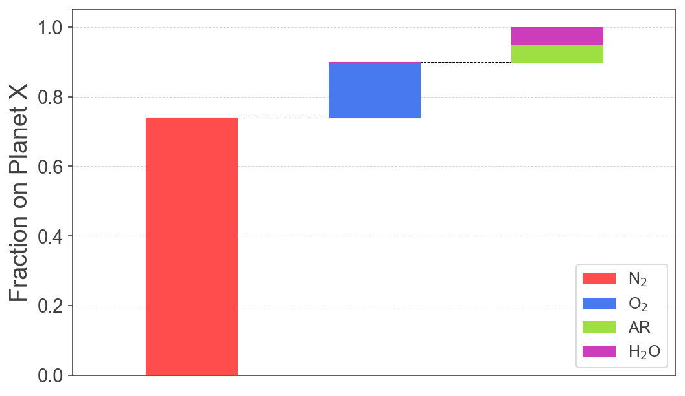
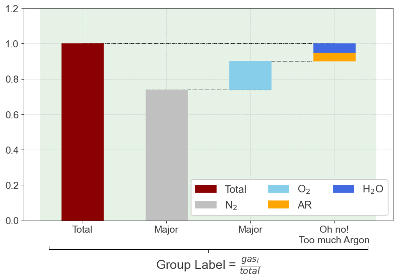
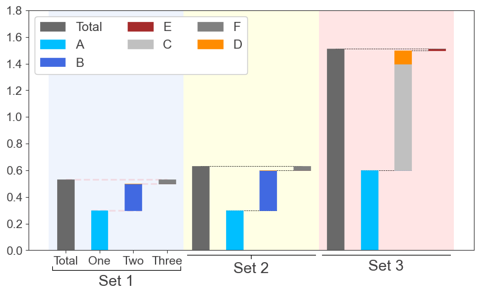

# Stacked Waterfalls

Simple utility to plot stacked waterfalls using `matplotlib`

Drew inspiration from [`waterfall_ax`](https://github.com/microsoft/waterfall_ax)

## Installation

```
pip install stackedwaterfalls
```
## Simple example

`stackedwaterfalls` expects a list of list, where each sublist represents a bar, and it's elements represent stacks within that bar.
Here's a simple example:
```python
from stackedwaterfalls import StackedWaterfalls as sw

aircomp  =  [[0.74] , [0.16], [0.05, 0.05]]
names = [['N$_2$'], ['O$_2$'], ['AR','H$_2$O']] # Labels of input values

air = sw(aircomp, names)
air.plot()
```


The colors are automatically picked if nothing is specified in a manner that every subsequent bar has as different a color from the previous as possible based on [this great answer here](https://gamedev.stackexchange.com/questions/46463/how-can-i-find-an-optimum-set-of-colors-for-10-players/46469#46469).

## Examples on group labels

This example shows how you can do a bunch of things with this:

```python
colors = [['silver'] , ['skyblue'], ['orange', 'royalblue']] 

A = sw(LH2_wind, names, colors)
A.plot(shadecolor = 'green', total = True,
       grouplabel ='Group Label = $\\frac{gas_i}{total}$', 
       barnames = ["Major", "Major", "Oh no!\nToo much Argon"],  
        legkw={'ncol':3,'framealpha':1.0, 'loc':'best', 'fontsize':15}, totalcolor = 'darkred',
       linkskw={'ls':'-.','lw':0.8, 'color':'k', 'alpha':1.0}, grouplabelstyle="]-")

A.ax.set_ylim(0,1.2)
```


## Example on combining graphs

The plotting routine also returns the extent of the x axis that is used so you can use that to add graphs to the right as follows:

```python
names = [['A'], ['B', 'C','D'], ['E', 'F']] # Labels of input values
data_set1 =  [[0.3] , [0.2, 0.0, 0.0], [0.0, 0.030]] 
data_set2 =  [[0.3] , [0.3, 0.0, 0.0], [0.0, 0.030]] 
data_set3 =  [[0.6] , [1e-16  , 0.8, 0.1], [0.01, 1e-16]] #need to set 0's here to very small num that is not zero to force legend elements
colors = [['deepskyblue'], ['royalblue', 'silver','darkorange'], ['brown', 'grey']]

d1 = StackedWaterfalls(data_set1,names, colors)
d2 = StackedWaterfalls(data_set2,names, colors)
d3 = StackedWaterfalls(data_set3,names, colors)

ax, xst2 = d1.plot(shadecolor = 'cornflowerblue',
                   legend=False, linkskw={'lw':'2', 'color':'red', 'alpha':0.1}, total = True, 
                   grouplabel = "Set 1", barnames=["One", "Two", "Three"], grouplabelstyle = ']')
                   
ax, xst3 =  d2.plot(shadecolor = 'yellow', ax = ax, xstart = xst2+0.4, total = True,grouplabel = "Set 2", 
                    grouplabelstyle = "|-",
                    legend=False)
ax, xst4 =  d3.plot(shadecolor = 'red', ax = ax, xstart = xst3+0.4, total = True, grouplabel = "Set 3",
                    grouplabelstyle = "|",
                    legend=True,  legkw={'ncol':3,'framealpha':1.0, 'loc':'best', 'fontsize':15})


ax.grid()
ax.set_ylim(0, 1.8)
plt.tight_layout()
```

